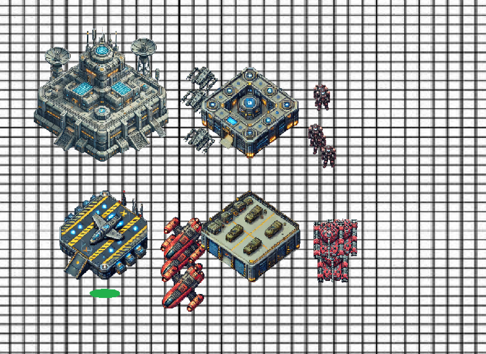

# Grid Sentinels
Welcome to Grid Sentinels. A multplayer red vs blue tower defense inspired game! Work against your opponent to destroy all of their buldings while defending your own from their troops. The winner is whoever can destroyed all of the other person's buildings first!

## Set Up and Installation
There is one additonal depedency for this game to work and that is `Pygame`. But don't worry it's pretty simple to install it. Make sure to use the appropriate method for installation depending on your platform. The most common one is: `pip install pygame`

To actually get the game running, make sure to clone this whole repository as many of the visual assests used are store locally within the repository.

### Setting up the Server
To get the server up and running it's as easy as passing one command through your terminal: `python3 play.py` This will prompt you to select if you are hosting or joining. Select hosting (1). It will give you your IP address which the players will need to join the game.

### Setting up the Client
Opening a client side game is similar to setting up the server. Run `python3 play.py` and then select joining (2) when prompted. You will be asked to input the server's IP address, which the host can supply to you. From there, wait until the other player connects and battle it out!

## Getting Started in Game
Some basic commands are to __press B__ to spawn all of the buildings. From there you can individually select a builing-- as indicated by the green circle under it. To spawn something choose a building and __press E__. Each of the four buildings spawn different entities: ships, tanks, soldiers, and collectors.

To attack you can select an entity (hold shift to select multiple) and then click one of the oppoiste team. Your troops or other attack entities will go attack the enemy!